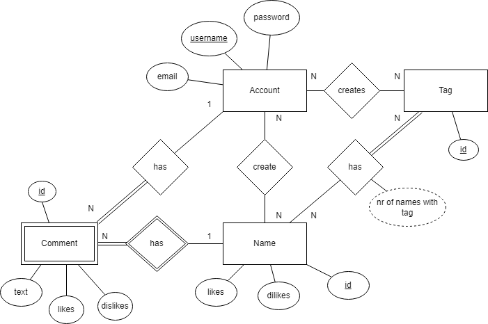
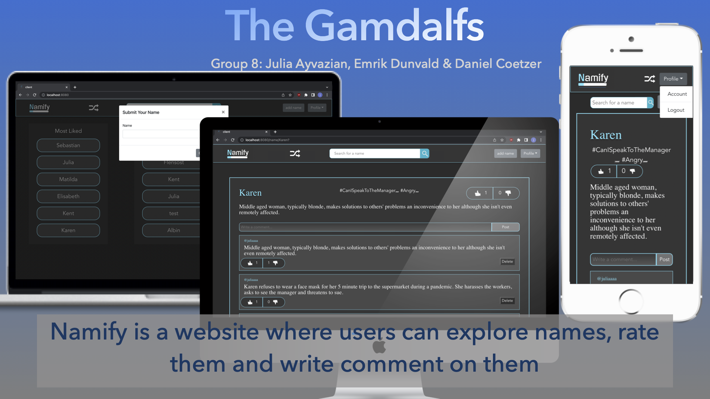

### Purpose

NOTE: This project was transfered from gitlab to my Github page for portfolio purposes.

The purpose is to allow users to look up new names in a fun way and create ratings and comments on them. As a user, you can add names to the website which allows other users to vote on the names, create comments and tags. Users also have access to a name chart where the most liked and disliked names are displayed, along with a random name generator. The random name generator will generate a name according to the users preferences.

### Pages

* Name: Displays rating and comments for a given name. This page allows the user to comment on the name, rate the name and create tags for the name.
* Account: Displays user information if the user has an account. If the user does not have an account it will show a button saying create account. This page allows the user to create an account. If the user has an account it will also allow the user to change information. 
* Home: Displays a search bar. This page allows the user to look up names and sort names by criterias.
* Randomiser: Displays a number of names from the database. The page allows the user to get a number of random names from the database. 

### Entity-Relationship (ER) Diagram

## Teaser (MS3)

